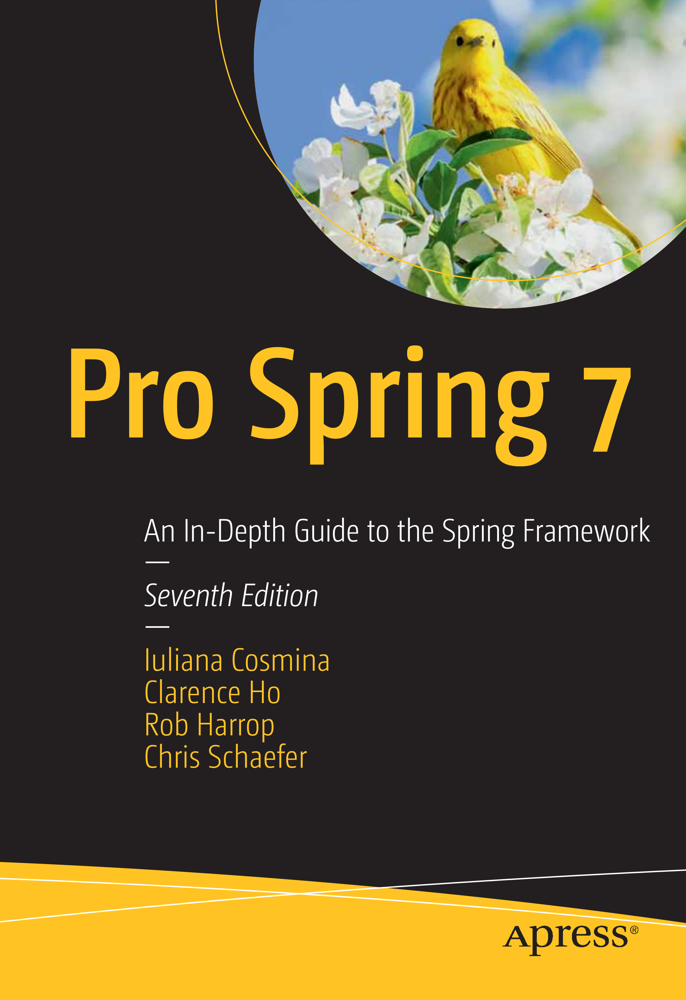

= Apress Source Code

This repository accompanies https://link.springer.com/book/9798868825910[**Pro Spring 7**] by Iuliana Cosmina, Rob Harrop, Chris Schaefer, Clarence Ho (Apress, 2026).

Download the files as a zip using the green button, or clone the repository to your machine using Git.

NOTE: Please don't skip reading this document https://imgflip.com/i/7sn8ut[before you get to work] and the AsciiDoc files specific to each project. This project contains comments and references explaining implementation decisions that could make another book in itself. So, enjoy!

== Releases

*Release v7.0* corresponds to the code in the second edition of the published book, without corrections or updates. There have been small changes in the project configuration files to provide a more stable and a more up-to-date build.

This project was built successfully with *JDK 26*, Gradle *9.4.1* . The syntax is specific to Java versions up to and including 26.

== Corrections

For corrections to the content in the published book, see the file link:Errata.adoc[Errata.adoc].

== Contributions

See the file link:Contributing.adoc[Contributing.adoc] for more information on how you can contribute to this repository.

== Building and Deploying

NOTE: This project requires https://podman.io[*Podman*] installed and running. *Chapter 19* also requires https://www.docker.com[*Docker*] for creating a Native image.

NOTE: Projects `pro-spring-7-classic/chapter06-jooq` and `pro-spring-7-boot/chapter06` were updated to allow for a full build, which requires some changes in the configuration of the Gradle files. However, they are still unpredictable, and sometimes they might fail because the container is not ready in time. I expect this to happen on slower computers. If this is an issue for you, just remove these projects from the general build, or just don't run the full build at all. Instructions on how to do so can be found in the book appendix.

NOTE: For easier Java (and Gradle) versions management, if you are using a Linux/macOS I also recommend installing https://sdkman.io[SDKMAN]. And running the following command, to use the same JDK I used when writing this project:

[source, shell]
----
> sdk install java 26-amzn
> sdk install gradle 9.4.1
----

The project is configured with the following default Gradle tasks:
----
defaultTasks 'clean', 'build'
----
This means that you do not have to specify those tasks when building the project from the terminal. Build it from scratch using the Gradle wrapper:
----
> ./gradlew
----
Or if you have Gradle installed locally, open a terminal and just run:
----
> gradle
----

If you want to skip the tests (build time will be shorter) run the wrapper with the following arguments:
----
> ./gradlew -x test
----
Or run Gradle with the following arguments
----
> gradle -x test
----

IMPORTANT: Since I did not add the Gradle wrapper jar to the repository, download it by running `gradle wrapper --gradle-version 9.4.1` .
