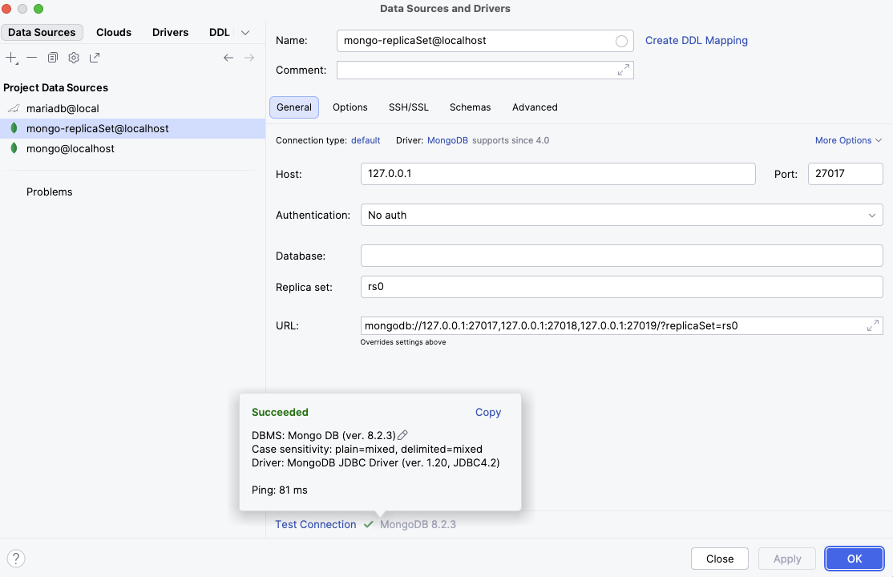

= Spring Data: MongoDB

You can choose to install MongoDB locally following the instructions on the official site. But you can also use MongoDB in a docker container (https://hub.docker.com/_/mongo).

There are two ways to run MongoDB: as a Standalone Self-Managed instance and as a Replica Set. The reason to use one way of the other depends on one thing: if you need transactions or not. Transactions were introduced in MongoDB 4.0. But unfortunately, most tools for installing and running MongoDB start a standalone server as opposed to a replica set. If you try to start a session on a standalone server, you'll get this error.

[source, text]
----
Mongodb v4.0 Transaction, MongoError: Transaction numbers are only allowed on a replica set member or mongos
----

== Running a Standalone Self-Managed MongoDB Instance using Podman

Change directory to `chapter09-mongo/podman-build` and run the following command to create the container image:

[source]
----
cd chapter09-mongo/podman-build
podman build -t prospring7-mongodb:9.2 .
----

Run the following to start the container:

[source, bash]
----
podman run --name local-ch09-mongodb -d -p 27017:27017 prospring7-mongodb:9.2
----

Use the IntelliJ IDEA to create a connection to localhost with the credentials in the `Containerfile` and feel free to query the documents as you write your Spring code.

image::mongodb_connection.png[mongodb_connection,300,align="center"]

Use the default QL console in IntelliJ IDEA and try these:

[source]
----
db

db.singers.find({})

db.singers.findOne({})

db.singers.findOne({'firstName': 'Ben'})
----

== Running a MongoDB ReplicaSet using Podman/Docker

To run a MongoDB ReplicaSet using Podman you need to install https://github.com/containers/podman-compose#installation[podman-compose].

[source, bash]
----
echo "127.0.0.1       host.podman.internal" >> /etc/hosts # making sure host.podman.internal can be resolved to the host machine's IP address
cd chapter09-mongo/podman-replicaset
./dbstart.sh
----

*NOTE:* If you use a Windows operating system, you can run the commands in `dbstart.sh` one by one manually in a terminal

If you prefer to use Docker, just make sure you install https://docs.docker.com/compose/install[docker-compose] first:

[source, bash]
----
echo "127.0.0.1       host.docker.internal" >> /etc/hosts # making sure host.docker.internal can be resolved to the host machine's IP address
cd chapter09-mongo/docker-replicaset
./dbstart.sh
----

Use the IntelliJ IDEA to create a connection to localhost with the credentials in the `Containerfile` and feel free to query the documents as you write your Spring code.

The file describes a three-node replica set setup. The container named `mongo1` is the primary node, and the two other containers are secondary nodes.

The `healthcheck` was repurposed to invoke `rs.initiate()` on the `mongo1` container to configure it as the primary node, and provide connection details for the secondary nodes.

The name of the replica st is `rs0`.

The `--bind_ip_all` flag is used to bind the MongoDB instance to all IPv4 addresses.

The `extra_hosts` section is used to map the `host.podman.internal/host.docker.internal` hostname to the host machine's IP address. (This replaces a `network` or `links` configuration, which makes it easy for the Spring application to connect to the cluster.)

The data is persisted in a Podman/Docker volume named `mongo1_data`. This is a best practice to ensure that the data is not lost when the container is stopped. The, `mongo1_config` is used to persist the replica set configuration.

When deleting the cluster, the columes are not deleted, so make sure you delete them manually.
