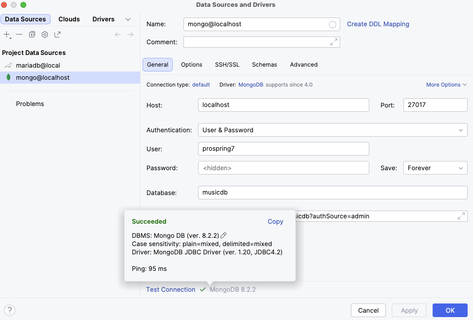

You can choose to install MongoDB locally following the instructions on the official site. But you can also use MongoDB in a docker container (https://hub.docker.com/_/mongo).

Change directory to `chapter09-mongo/podman-build` and run the following command to create the container image:

[source]
----
podman build -t prospring6-mongodb:9.2 .
----

Run the following to start the container:

[source]
----
podman run --name local-ch09-mongodb -d -p 27017:27017 --mount type=volume,src=mongodbdata,dst=/data/db prospring6-mongodb:9.2
----

Use the IntelliJ IDEA to create a connection to localhost with the credentials in the `Containerfile` and feel free to query the documents as you write your Spring code.

Use the default QL console in IntelliJ IDEA and try these:

[source]
----
db

db.singers.find({})

db.singers.findOne({})

db.singers.findOne({'firstName': 'Ben'})
----
